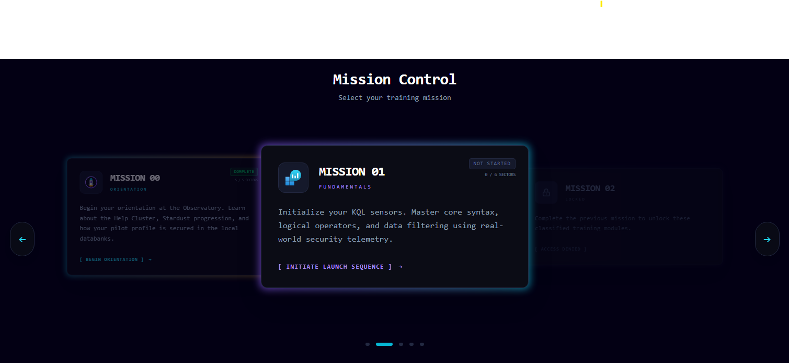

# Astro KQL

> A gamified, interactive platform for learning Kusto Query Language (KQL).



## About The Project

This project is a static web application built with **Astro** and **React** that teaches users how to write KQL queries through a series of narrative-driven "Space Missions".

Users take on the role of a data detective in a sci-fi setting, using real KQL queries to solve puzzles, analyze logs, and uncover mysteries.

## Features

* **Interactive Holodeck**: A Monaco-based code editor with KQL syntax highlighting.
* **Real-world Queries**: "Uplink" feature to run queries directly in Azure Data Explorer.
* **Gamification**: Earn "Stardust", level up, and track your daily streak.
* **Narrative Missions**: Learn concepts like filtering, aggregation, and joins through story.

## Built With

* [Astro](https://astro.build/) - The web framework
* [React](https://reactjs.org/) - UI Components
* [Tailwind CSS](https://tailwindcss.com/) - Styling
* [Monaco Editor](https://microsoft.github.io/monaco-editor/) - Code editing experience

## Getting Started

To run this project locally:

1. **Clone the repo**

   ```bash
   git clone https://github.com/YOUR_USERNAME/astro.git
   ```

2. **Install NPM packages**

   ```bash
   npm install
   ```

3. **Run the dev server**

   ```bash
   npm run dev
   ```

## Contributing

Contributions are what make the open source community such an amazing place to learn, inspire, and create. Any contributions you make are **greatly appreciated**.

See [CONTRIBUTING.md](CONTRIBUTING.md) for detailed instructions on how to add new missions or features.

## License

Distributed under the MIT License. See `LICENSE` for more information.
